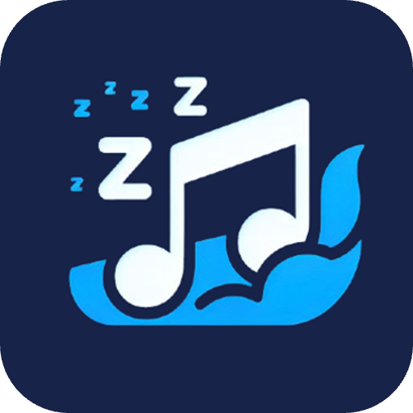

# Lazzy Music

    

正如其名，我折腾是想大家不用折腾，Lazzy Music 是一个自带客户端（播放器）的多平台的本地音乐流媒体服务，支持视频格式，支持导入或订阅外部音乐，支持元信息刮削和编辑，希望能给你一个涵盖音乐获取、管理、播放的无缝优质体验。

## 功能特性 :sparkles: 

- **支持视频形式的音乐**：音乐不只是音频，拯救想将 Live、MV 等统一纳入音乐收藏的你
- 多种形式入库：
    - 导入已有的本地文件
    - 导入其他平台单曲(视频)
      * [x] 从 Bilibili App 分享
      * [ ] Youtube App
      * [ ] 网易云、QQ 音乐等？见 Q&A
        
    - 订阅外部播放列表：不用离开当前 app，你只管收藏，我来定时检查并导入外部歌单新增的部分
        
      * [x] Bilibili 收藏夹
      * [ ] Youtube 播放列表
      * [ ] 网易云、QQ 音乐等？见 Q&A
        
- 媒体信息刮削与编辑：
    - **入库刮削**：入库时自动匹配元信息（歌曲名，歌手，歌词，专辑封面，专辑曲目等），即使文件信息残缺也会尝试通过声纹匹配。
    - **元信息编辑**：随时轻松地为歌曲纠正和补充元信息，目前支持搜索和指定歌手，专辑，歌词。
    - 支持歌曲和专辑多位歌手，支持专辑多音轨
    - “化繁为简”：歌名、歌手名等统一为简体，因此也不会有音乐库中同时存在周杰伦和周杰倫这种尴尬。
- 组织与播放：
    - 支持按专辑，歌手，歌单查看歌曲，支持按常见关键字排序。
    - 支持播放队列和不同的循环模式
    - **支持歌词，支持双行歌词，并可以调整歌词时间偏移。**
    - 支持后台播放，支持通过通知栏，控制中心控制。
    - 基于 Material 3 的简洁纯粹的 UI
- 多平台：
    - 服务端：Windows，Mac OS
    - 客户端：Android，iOS
- **外网访问**：一键尝试开启端口转发以支持外网访问，同时你可以自定义自行设置好转发的端口。
- **音乐库(包括元信息)的一切均保存在您的设备上**，无广无数据外泄，没有下架没有变灰，迁移友好，哪天你用或者不再使用 Lazzy Music 了，你的音乐依然静静躺在那里。

## 快速开始 :rocket: 

 1. 在你的 PC 上安装 Lazzy Music 服务端，在手机上安装客户端，登录同一个账号
 2. 将你的音乐文件扔到媒体库文件夹然后执行扫描
这样就就可以在客户端刷新看到你的音乐库了。具体如下：

### 服务端

前往[这里](https://github.com/orangex/LazzyMusic-Server/releases)下载最新版本 ，安装运行后系统托盘中（Mac 为屏幕右上角状态栏）会出现 LazzyMusic 的图标，右键登录即可。

更新方式：Windows 下载新的版本后直接将旧版本的程序删除然后安装新版本运行即可，Mac 常规安装新版即会覆盖更新。均需先退出程序。

### 客户端

iOS 已上架 [TestFlight](https://testflight.apple.com/join/5HaBxGxZ)，当然你可以通过下面的链接自行签名安装。

Android 暂未上架应用商店，可以直接通过（在手机的浏览器上访问，最好别用微信内置浏览器）下面的链接下载安装。

[客户端最新安装包](https://github.com/orangex/LazzyMusic/releases)，该链接指向的就是该仓库的 Release 。

### 添加第一首音乐

服务端右键托盘图标→打开媒体库文件夹，将你的音乐文件扔到里面，然后扫描仓库。

等待片刻，在客户端主页下拉刷新就会看见音乐在逐一出现在列表中了。

你也可以订阅外部的歌单，详见 Q&A。
## 截图展示 :camera:

服务端除了托盘图标和菜单，目前没有 GUI，以下为客户端部分界面展示。

## Q&A :question: 后续更多问题会考虑做成文档。

1. 如何反馈问题，提出建议？有主页和其他动态发布的方式吗？

   GitHub issues 相对正式，可以集中查看。可以将这里暂时视作主页
   [Telegram 群组](https://t.me/+sNoE3YvedOoyZjU1) 用于快捷交流产品问题。
   另，本项目并非开源项目。
4. 为什么要登录？我可以在多个地方登录吗？
   
   不登录后面怎么收费（手动狗头）？登录确实是方便收费的途径，不过暂时没考虑这些。
   设计登录的第一因仅仅是因为想降低使用的门槛，不需要用户知道 ip 端口甚至 DDNS 什么的。可能有点拧巴，因为搭建本地音乐库在大家的印象里是一个有门槛的事情，但恰恰想做的就是把它变成一个没有太多电脑基础常识的人也能用的产品。用过 plex 的可能比较熟悉，只需要登录同一个账号，就能帮你的 app 连到服务端。
   客户端可以多处登录。服务端不行，不然客户端不知道到底要连接哪个音乐库。而目前还未开发对服务端的登录限制，因此为了避免异常，如果你要在别处再次登录服务端，请在先前的设备上先登出服务端。
    
6. 我想导入网易云、 qq 音乐、Spotify的歌曲怎么办？
   
   首先，这些年大家应该发现了凡是提供这些平台音乐直接下载的基本都吃到大棒凉凉了，剩下的都是偷偷摸摸，三天两头复活一次的那种。我折腾过感觉也备感心累，因此 Lazzy Music 不会提供这些平台的音乐的直接下载。但是，大家知道 youtube 的音乐可以说应有尽有，所以为了一种可行的办法是为大家去 youtube 匹配歌曲并下载，这也是 [SpotDL](https://github.com/spotDL/spotify-downloader)等的实现原理。
    
8. 在设置中有一项叫做通过端口转发从外网访问，什么意思？我没有公网 IP 可以吗？
    
    简单来说，你的手机（客户端）和你的 PC（服务端） 同时连着家里的路由，这就叫内网，这种状态下你无需额外操作就能访问你的音乐。但如果你出门了，甭管是 4g 5g 网络还是连了别的 wifi，这时候想要访问你仍在内网的服务端就有问题了，因为在公网中只能通过一个服务的公网 IP 和对应的端口来访问它，但一个内网中的服务，它只有一个内网的 IP 和内网的端口，这时可以在路由器上配置转发规则将对该公网下某端口的请求映射到某内网 IP的某端口上。这样就实现了从外界访问你的本地服务。按照惯例得提醒你，通过端口转发实际上是将你局域网中的设备暴露在了互联网上，有一定风险。
    
    所以，想要通过该方式从外网访问，一定需要公网 IP，目前国内的现状是普遍需要自行向运营商申请(申请到的是动态 IP也可以的)，申请方法和申请后的光猫改桥接等配置操作网络上有很多经验贴可以参考，这可能是最有门槛的事情了，如果你想外网访问的话。不过 Lazzy Music 并不要求公网 IP 是静态的， 这也是前面提到的要登录的原因之一。
    如果你只是偶尔路上想听会歌，相信后续的客户端缓存歌曲的功能应该能一定程度满足需求。
    
    同时会考虑以更多形式支持从外网访问的需求，比如自行指定服务器地址等等。
    
9. 如何订阅外部歌单（Bilibili 收藏夹）?
    
    订阅外部歌单的行为是绑定在内部歌单上的，这是为了更好的归集不同歌单的音乐，比如你可以在一个叫“Live 集合”的内部歌单中订阅不同平台（虽然目前还只支持 bilibili）的“我喜欢的 Live” 歌单。
    
    订阅操作：你可以通过歌单→三个点→为歌单新增订阅一个外部歌单，也可以在应用顶部点击“+”号→订阅 bilibili 收藏夹的方式快捷创建一个订阅某外部歌单的歌单，均需要输入外部歌单的链接。
    
    Bilibili 收藏夹链接目前只能通过前往 Bilibili 网站获取，在收藏页面左侧找到你创建的收藏夹，复制此时浏览器地址栏的地址即可，地址形如：[https://space.bilibili.com/4932305/favlist?fid=1234567890&ftype=create](https://space.bilibili.com/4932305/favlist?fid=2813308305&ftype=create) ，也可以点击进入该收藏夹详情，复制此时地址栏地址，形如[https://www.bilibili.com/medialist/detail/ml1234567890?](https://www.bilibili.com/medialist/detail/ml2813308305?) ，注意收藏夹需要是公开的（默认就是公开的）。
    
    取消订阅：歌单→三个点→为该歌单取消订阅某个外部歌单，或者你可以直接删除某内部歌单，其订阅行为也随之消失。
    
11. 商业定价？
    
    没来得及想，先完善产品，有计划会及时同步。
10. 产品思路及后续开发计划？
    
    核心还围绕为本身就有（本地）音乐收藏或着构建私人音乐库有兴趣的用户，让获取和入库音乐更简易，支持的方式和平台更多，让音乐库（元信息）的获取和整理变的更省心，同时提升音乐播放的质量和体验。开发计划目前比较零碎，还需要大家的声音和建议。
